# 🏗️ ChatApp TIER-6 Architecture - Complete System Design

> **Staff-Level Production-Ready Architecture**  
> Multi-Repo GitOps | Full Observability | Auto-Scaling | Multi-Environment

---

## 📊 **Complete Architecture Diagram**

```mermaid
graph TB
    subgraph "🔧 CI/CD Pipeline"
        GH_CHAT[GitHub: ChatApplication<br/>App Code + Helm Chart]
        GH_OBS[GitHub: Observability<br/>Infrastructure as Code]
        GH_GITOPS[GitHub: CompanyGitOps<br/>Deployment Configs]
        
        JENKINS[Jenkins CI/CD<br/>- Build Images<br/>- Push to ECR<br/>- Update GitOps Repo]
        
        GH_CHAT -->|"Webhook on Push"| JENKINS
        JENKINS -->|"1. Build & Push Images"| ECR[AWS ECR<br/>Container Registry]
        JENKINS -->|"2. Update Image Tags"| GH_GITOPS
    end
    
    subgraph "🏗️ Infrastructure Provisioning"
        TF_INFRA[Terraform<br/>Observability Repo]
        
        TF_INFRA -->|"Creates"| EKS[AWS EKS Cluster<br/>Kubernetes 1.28]
        TF_INFRA -->|"Deploys Helm Charts"| PROM[Prometheus Stack]
        TF_INFRA -->|"Deploys Helm Charts"| JAEGER[Jaeger Tracing]
        TF_INFRA -->|"Deploys Helm Charts"| LOKI[Loki Logging]
        TF_INFRA -->|"Deploys Helm Charts"| ARGOCD[ArgoCD GitOps]
        TF_INFRA -->|"Configures"| KARPENTER[Karpenter<br/>Auto-Scaling]
    end
    
    subgraph "🔄 GitOps Deployment"
        ARGOCD -->|"Watches Git Repo"| GH_GITOPS
        ARGOCD -->|"Auto-Sync: Dev/Staging<br/>Manual: Prod"| K8S_NS
        
        subgraph "☸️ Kubernetes Namespaces"
            K8S_NS[Namespace Strategy]
            
            subgraph "📦 chatapp-dev"
                BE_DEV[Backend Pod]
                FE_DEV[Frontend Pod]
                ING_DEV[Ingress]
            end
            
            subgraph "📦 chatapp-staging"
                BE_STG[Backend Pod]
                FE_STG[Frontend Pod]
                ING_STG[Ingress]
            end
            
            subgraph "📦 chatapp-prod"
                BE_PROD[Backend Pod]
                FE_PROD[Frontend Pod]
                ING_PROD[Ingress]
            end
        end
    end
    
    subgraph "📊 Observability Stack"
        subgraph "📦 monitoring namespace"
            PROM -->|"Scrapes Metrics"| BE_DEV
            PROM -->|"Scrapes Metrics"| BE_STG
            PROM -->|"Scrapes Metrics"| BE_PROD
            
            OTEL[OpenTelemetry<br/>Collector]
            BE_DEV -->|"OTLP Traces"| OTEL
            BE_STG -->|"OTLP Traces"| OTEL
            BE_PROD -->|"OTLP Traces"| OTEL
            OTEL -->|"Export"| JAEGER
            
            PROMTAIL[Promtail]
            BE_DEV -.->|"Pod Logs"| PROMTAIL
            BE_STG -.->|"Pod Logs"| PROMTAIL
            BE_PROD -.->|"Pod Logs"| PROMTAIL
            PROMTAIL -->|"Push Logs"| LOKI
            
            GRAF[Grafana Dashboards]
            GRAF -->|"Query Metrics"| PROM
            GRAF -->|"Query Traces"| JAEGER
            GRAF -->|"Query Logs"| LOKI
            
            ALERTMGR[AlertManager]
            PROM -->|"Fire Alerts"| ALERTMGR
            ALERTMGR -->|"Route to Slack"| SLACK[Slack Notifications]
        end
    end
    
    subgraph "🌐 External Access"
        USER[End Users]
        DEVOPS[DevOps Team]
        
        USER -->|"HTTPS"| ING_DEV
        USER -->|"HTTPS"| ING_STG
        USER -->|"HTTPS"| ING_PROD
        
        DEVOPS -->|"View Dashboards"| GRAF
        DEVOPS -->|"Manage Apps"| ARGOCD
    end
    
    subgraph "☁️ AWS Services"
        EKS
        ECR
        SECRETS[AWS Secrets Manager]
        VPC[VPC + Subnets]
        
        EKS -.->|"Runs on"| VPC
        BE_DEV -->|"Fetch Secrets"| SECRETS
        BE_STG -->|"Fetch Secrets"| SECRETS
        BE_PROD -->|"Fetch Secrets"| SECRETS
    end
    
    subgraph "⚡ Auto-Scaling"
        KARPENTER -->|"Provisions Nodes"| EKS
        PROM -->|"Metrics"| KARPENTER
        
        HPA[Horizontal Pod<br/>Autoscaler]
        PROM -.->|"Custom Metrics"| HPA
        HPA -->|"Scale Pods"| BE_DEV
        HPA -->|"Scale Pods"| BE_STG
        HPA -->|"Scale Pods"| BE_PROD
    end

    style GH_CHAT fill:#2ea44f
    style GH_OBS fill:#2ea44f
    style GH_GITOPS fill:#2ea44f
    style JENKINS fill:#d24939
    style ARGOCD fill:#ef7b4d
    style PROM fill:#e6522c
    style GRAF fill:#f46800
    style JAEGER fill:#60d0e4
    style LOKI fill:#00a273
    style EKS fill:#ff9900
```



---

## 🎯 **Architecture Principles**

### **1. Separation of Concerns (3 Git Repositories)**

| Repository | Purpose | Owner | Contents |
|------------|---------|-------|----------|
| **ChatApplication** | Application Code | Dev Team | Source code, Dockerfiles, Helm chart template |
| **Observability** | Infrastructure | Platform Team | Terraform, Helm configs, Monitoring stack |
| **CompanyGitOps** | Deployment Configs | DevOps Team | ArgoCD apps, Environment-specific values |

### **2. GitOps Workflow**

```
Developer Push → GitHub Webhook → Jenkins CI
                                      ↓
                          Build Image → Push to ECR
                                      ↓
                          Update GitOps Repo (values.yaml)
                                      ↓
                          ArgoCD Detects Change (every 3min)
                                      ↓
                          Auto-Deploy (dev/staging) or Manual (prod)
```

### **3. Environment Strategy**

| Environment | Namespace | Sync Mode | Purpose |
|-------------|-----------|-----------|---------|
| **Dev** | `chatapp-dev` | Auto-Sync | Rapid iteration, testing |
| **Staging** | `chatapp-staging` | Auto-Sync | Pre-prod validation |
| **Prod** | `chatapp-prod` | **Manual Sync** | Production traffic |

### **4. Observability Triad**

```
📈 METRICS (Prometheus)
   ↓ Correlated to
🔍 TRACES (Jaeger)
   ↓ Correlated to
📝 LOGS (Loki)
```

**Key Features:**
- ✅ Click metric spike → Jump to related traces
- ✅ Click trace → Jump to related logs
- ✅ Unified dashboard per environment
- ✅ SLO-based alerting with runbooks

---

## 🔄 **CI/CD Flow - Detailed**

### **Phase 1: Code Commit**
```bash
1. Developer pushes to ChatApplication repo (main branch)
2. GitHub webhook triggers Jenkins
3. Jenkins starts Jenkinsfile.cd pipeline
```

### **Phase 2: Build & Push**
```bash
4. Jenkins builds Docker images:
   - Backend: python:3.9-slim base
   - Frontend: node:18-alpine build → nginx:alpine runtime
5. Tags images: <service>-<env>-<git-short-sha>
6. Pushes to AWS ECR
```

### **Phase 3: GitOps Update**
```bash
7. Jenkins clones CompanyGitOps repo
8. Updates applications/chatapp/<env>/values.yaml:
   backend:
     image:
       repository: <ecr-url>
       tag: backend-dev-abc1234
9. Commits & pushes to CompanyGitOps
```

### **Phase 4: ArgoCD Sync**
```bash
10. ArgoCD polls CompanyGitOps every 3 minutes
11. Detects new image tag
12. Applies Helm chart with new values
13. Kubernetes rolling update (zero downtime)
```

---

## 📊 **Observability Flow - Staff-Level**

### **1. Metrics Collection**
```
Application → ServiceMonitor → Prometheus → Grafana
              (scrape /metrics  (TSDB)      (visualize)
               every 30s)
```

**Metrics Exposed:**
- `http_requests_total` (counter by endpoint, method, status)
- `http_request_duration_seconds` (histogram for latency)
- `http_requests_in_progress` (gauge)

### **2. Trace Collection**
```
Application → OTLP Exporter → OTel Collector → Jaeger
              (gRPC 4317)     (process)        (storage)
```

**Trace Data:**
- Request ID across services
- Span duration per operation
- Parent-child relationships
- Error propagation

### **3. Log Collection**
```
Pod stdout → Promtail → Loki → Grafana
             (tail)     (index) (query)
```

**Log Enrichment:**
- Pod name, namespace
- Container name
- Node name
- Custom labels (env, service)

### **4. Correlation**
```
Grafana Dashboard:
├─ Metric spike (error rate) → Click
│  └─ Filtered traces for that timeframe
│     └─ Select failing trace → Click
│        └─ Logs for that trace_id
```

---

## 🚨 **Alerting Architecture**

### **Alert Flow**
```
Prometheus → Alert Rule Evaluation → AlertManager → Routing
             (every 1min)            (grouping)      (Slack/PagerDuty)
                                     (inhibition)
```

### **SLO-Based Alerts**

| Alert | SLI | SLO | Threshold | Action |
|-------|-----|-----|-----------|--------|
| **HighErrorRate** | Success Rate | 99.9% | 2% errors (5min) | Check traces |
| **HighLatency** | P95 Latency | <500ms | P95 >500ms (5min) | Check slow spans |
| **ServiceDown** | Availability | 99.95% | 0 pods ready | Check events |

### **Inhibition Rules**
```yaml
# Suppress latency/error alerts if service is completely down
ServiceDown → Inhibits → [HighLatency, HighErrorRate]
```

---

## ⚡ **Auto-Scaling Strategy**

### **1. Horizontal Pod Autoscaler (HPA)**
```yaml
Metrics:
- CPU: 70% target
- Custom: http_requests_per_second
Scale Range: 2-10 pods per service
```

### **2. Karpenter Node Provisioning**
```yaml
Requirements:
- Instance types: t3.medium, t3.large, t3a.medium
- Capacity type: on-demand (spot planned for cost optimization)
- Architecture: amd64
- Lifecycle: Delete nodes after 7 days (rolling)
```

---

## 🔐 **Security Posture** (Planned)

```
✅ AWS Secrets Manager integration
✅ IRSA (IAM Roles for Service Accounts)
✅ Network isolation per namespace
⏳ Pod Security Standards (restricted)
⏳ Network Policies (default deny)
⏳ Non-root containers
⏳ Read-only root filesystem
```

---

## 📂 **Repository Structure**

### **ChatApplication Repo**
```
ChatApplication/
├── backend-service/          # Flask app
├── frontend-service/         # React app
├── helm-chart/               # Modular Helm chart
│   ├── templates/
│   │   ├── backend/
│   │   ├── frontend/
│   │   └── monitoring/
│   └── values.yaml           # Default values
└── Jenkins/
    └── gitops/
        └── Jenkinsfile.cd    # CI/CD pipeline
```

### **Observability Repo**
```
Observability/
├── infra-tf/                 # Terraform for infrastructure
│   ├── main.tf
│   ├── eks.tf
│   ├── karpenter-resources.tf
│   └── helm/                 # Helm values
│       ├── prometheus/
│       ├── jaeger/
│       ├── loki/
│       ├── promtail/
│       ├── otel-collector/
│       └── argocd/
├── grafana-tf/               # Grafana as code
│   ├── main.tf
│   ├── alerts/
│   │   └── chatapp-alerts.yaml
│   └── dashboards/
│       └── chatapp-observability-triad.json
├── docs/                     # Documentation
│   ├── SLI-SLO-DEFINITION.md
│   ├── STAFF-LEVEL-OBSERVABILITY.md
│   ├── ALERTING-GUIDE.md
│   └── runbooks/
│       ├── HIGH-ERROR-RATE.md
│       ├── HIGH-LATENCY.md
│       └── SERVICE-DOWN.md
└── Jenkins/
    └── Jenkinsfile.infrastructure
```

### **CompanyGitOps Repo**
```
CompanyGitOps/
├── argocd/
│   ├── projects/
│   │   └── chatapp-project.yaml     # RBAC, policies
│   └── applications/
│       ├── chatapp-dev.yaml         # Dev app definition
│       ├── chatapp-staging.yaml
│       └── chatapp-prod.yaml
└── applications/
    └── chatapp/
        ├── helm-chart/              # Copy of ChatApp Helm chart
        ├── dev/
        │   └── values.yaml          # Dev-specific overrides
        ├── staging/
        │   └── values.yaml
        └── prod/
            └── values.yaml
```

---

## 🎓 **Key Design Decisions**

### **1. Why 3 Separate Repos?**
- **Blast radius:** Infrastructure changes don't affect app deployments
- **Access control:** Different teams, different permissions
- **Git history:** Clear audit trail per domain
- **Release cadence:** Infrastructure changes weekly, app changes daily

### **2. Why ArgoCD over Helm from Jenkins?**
- **Declarative:** Desired state in Git, ArgoCD ensures actual state matches
- **Audit trail:** All changes visible in Git commits
- **Self-healing:** ArgoCD detects drift and auto-corrects
- **Manual approval:** Production changes require explicit sync
- **Rollback:** Git revert = automatic rollback

### **3. Why OpenTelemetry Collector?**
- **Vendor neutral:** Can switch from Jaeger to Tempo without app changes
- **Processing:** Sampling, filtering, enrichment before storage
- **Multi-backend:** Send traces to multiple destinations
- **Future-proof:** CNCF standard

### **4. Why Loki over ELK?**
- **Cost:** 10x cheaper (indexes labels, not full text)
- **Simplicity:** Single binary, no Elasticsearch cluster
- **Prometheus-like:** Same query language (LogQL)
- **Cloud-native:** Designed for Kubernetes

---

## 📈 **Metrics Dashboard Panels**

```
Row 1: Service Health
├─ Request Rate (QPS)
├─ Success Rate (%)
└─ Error Budget Remaining

Row 2: Latency
├─ P50 Latency
├─ P95 Latency
└─ P99 Latency

Row 3: Traces
└─ Request Traces by Endpoint (click to open Jaeger)

Row 4: Logs
└─ Application Logs (filtered by trace_id from above)
```

---

## 🔗 **Data Correlation Example**

### **Scenario: High Error Rate Alert**
```
1. Slack alert: "ChatappHighErrorRate firing"
   └─ Click runbook link
2. Runbook: "Check Grafana dashboard"
   └─ Click dashboard link
3. Dashboard: Error rate spike at 14:23
   └─ Click on red spike
4. Traces panel: Filtered to 14:20-14:25
   └─ See 15 failing traces for POST /api/messages
   └─ Click one trace
5. Jaeger UI opens: Trace shows 500ms timeout to database
   └─ Copy trace_id: abc123def456
6. Back to Grafana logs panel:
   └─ Query: {trace_id="abc123def456"}
   └─ Logs show: "Connection pool exhausted"
7. Resolution: Scale up database connections
```

---

## 🚀 **Deployment Commands**

### **Initial Infrastructure Setup**
```bash
# 1. Deploy EKS + Observability stack
cd Observability/infra-tf
terraform init
terraform apply

# 2. Configure Grafana datasources & dashboards
cd ../grafana-tf
terraform init
terraform apply

# 3. Deploy ArgoCD applications
kubectl apply -f CompanyGitOps/argocd/projects/chatapp-project.yaml
kubectl apply -f CompanyGitOps/argocd/applications/chatapp-dev.yaml
kubectl apply -f CompanyGitOps/argocd/applications/chatapp-staging.yaml
kubectl apply -f CompanyGitOps/argocd/applications/chatapp-prod.yaml
```

### **Deploy New Version**
```bash
# 1. Push code to GitHub
git push origin main

# 2. Jenkins automatically:
#    - Builds image
#    - Pushes to ECR
#    - Updates CompanyGitOps/applications/chatapp/dev/values.yaml

# 3. ArgoCD automatically (dev/staging) or manually (prod):
#    - Detects change
#    - Syncs cluster state
#    - Rolling update pods

# 4. Verify deployment
kubectl get pods -n chatapp-dev
argocd app get chatapp-dev
```

---

## 🎯 **Success Metrics**

| Metric | Target | Current |
|--------|--------|---------|
| **Deployment Frequency** | Multiple times/day | ✅ Automated |
| **Lead Time** | <15 minutes | ✅ ~10 min |
| **MTTR** | <30 minutes | ✅ Trace → Logs |
| **Change Failure Rate** | <5% | ✅ Staging gates |
| **Observability Coverage** | 100% | ✅ Metrics/Traces/Logs |

---

## 🏆 **TIER-6 Achievements**

✅ **Infrastructure as Code:** 100% Terraform, zero ClickOps  
✅ **GitOps:** Declarative deployments, Git as source of truth  
✅ **Full Observability:** Metrics + Traces + Logs with correlation  
✅ **SLO-Based Alerting:** Intelligent alerts with runbooks  
✅ **Multi-Environment:** Dev/Staging/Prod with proper gating  
✅ **Auto-Scaling:** Pod and node level scaling  
✅ **CI/CD Automation:** Zero manual deployment steps  
✅ **Separation of Concerns:** Clear boundaries, multiple repos  
✅ **Production-Ready:** Self-healing, monitoring, alerting  

---

## 📚 **Related Documentation**

- [SLI/SLO Definitions](./SLI-SLO-DEFINITION.md)
- [Staff-Level Observability](./STAFF-LEVEL-OBSERVABILITY.md)
- [Alerting Guide](./ALERTING-GUIDE.md)
- [GitOps Workflow](./GITOPS-WORKFLOW.md)
- [Runbooks](./runbooks/)

---

**Last Updated:** 2026-01-19  
**Architecture Version:** 1.0  
**Status:** Production-Ready ✅

